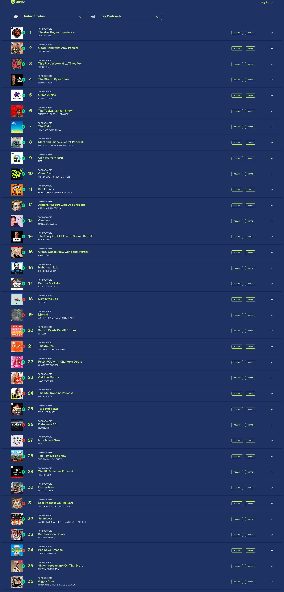

# 🎙️ Dwarkesh Podcast - Spotify Chart Rankings

## Latest Update
- **Date**: 2025-11-29
- **Ranking**: # 📊
- **Trend**: First recording
- **Status**: ❌ Not found on charts

## Recent History (Last 10 Days)

| Date | Ranking | Change | Notes |
|------|---------|--------|-------|
| 2025-11-29 | # | - | Dwarkesh Podcast is not visible in the top 36 rank |
| 2025-11-28 | # | - | Dwarkesh Podcast does not appear in the top 36 pod |
| 2025-11-27 | # | - | Dwarkesh Podcast does not appear in the visible To |
| 2025-11-26 | # | - | Dwarkesh Podcast is not visible in rankings 1-36 o |
| 2025-11-25 | # | - | Dwarkesh Podcast is not visible in the displayed T |
| 2025-11-24 | # | - | Dwarkesh Podcast does not appear in the visible to |
| 2025-11-23 | # | - | Dwarkesh Podcast does not appear in the visible to |
| 2025-11-22 | # | - | Dwarkesh Podcast is not visible in the top 36 podc |
| 2025-11-21 | #99 | - | Found at rank 99 in the TOP PODCASTS category, lis |
| 2025-11-20 | # | - | Dwarkesh Podcast does not appear in the visible ra |

## 📈 Statistics
- **Best Ranking**: #16
- **Current Ranking**: #
- **Average Ranking**: #50.7
- **Total Tracking Days**: 49
- **Days on Charts**: 15

## 📸 Latest Screenshot

---
*Last updated: 2025-11-29 10:06:09 UTC*
*Tracking powered by Claude Vision API & Playwright*
