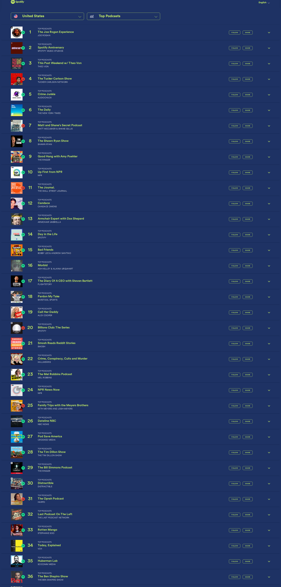

# 🎙️ Dwarkesh Podcast - Spotify Chart Rankings

## Latest Update
- **Date**: 2025-11-22
- **Ranking**: # 📊
- **Trend**: First recording
- **Status**: ❌ Not found on charts

## Recent History (Last 10 Days)

| Date | Ranking | Change | Notes |
|------|---------|--------|-------|
| 2025-11-22 | # | - | Dwarkesh Podcast is not visible in the top 36 podc |
| 2025-11-21 | #99 | - | Found at rank 99 in the TOP PODCASTS category, lis |
| 2025-11-20 | # | - | Dwarkesh Podcast does not appear in the visible ra |
| 2025-11-19 | # | - | Searched all 36 visible podcast entries including  |
| 2025-11-18 | # | - | Dwarkesh Podcast does not appear in the visible to |
| 2025-11-17 | # | - | Searched through all 36 visible podcasts in the ch |
| 2025-11-16 | # | - | Dwarkesh Podcast does not appear in the visible to |
| 2025-11-15 | # | - | Dwarkesh Podcast does not appear in the visible to |
| 2025-11-14 | # | - | Dwarkesh Podcast does not appear in the visible to |
| 2025-11-13 | # | - | Dwarkesh Podcast is not visible in positions 1-36  |

## 📈 Statistics
- **Best Ranking**: #16
- **Current Ranking**: #
- **Average Ranking**: #50.7
- **Total Tracking Days**: 42
- **Days on Charts**: 15

## 📸 Latest Screenshot

---
*Last updated: 2025-11-22 10:18:42 UTC*
*Tracking powered by Claude Vision API & Playwright*
