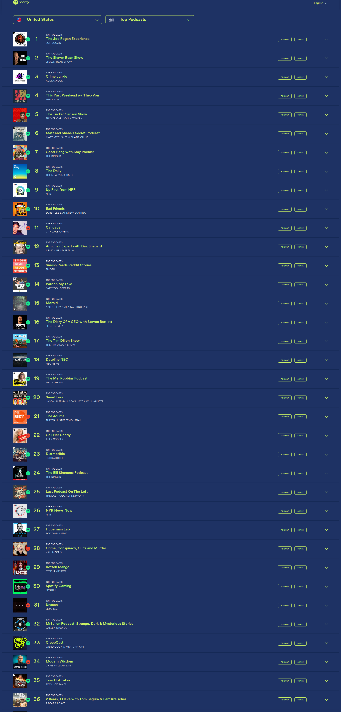

# 🎙️ Dwarkesh Podcast - Spotify Chart Rankings

## Latest Update
- **Date**: 2025-12-29
- **Ranking**: # 📊
- **Trend**: First recording
- **Status**: ❌ Not found on charts

## Recent History (Last 10 Days)

| Date | Ranking | Change | Notes |
|------|---------|--------|-------|
| 2025-12-29 | # | - | Dwarkesh Podcast or any variation was not found in |
| 2025-12-28 | # | - | Searched through all 36 visible podcasts in the ch |
| 2025-12-27 | # | - | Dwarkesh Podcast does not appear in the visible To |
| 2025-12-26 | # | - | Dwarkesh Podcast is not visible in the top 36 rank |
| 2025-12-25 | # | - | Dwarkesh Podcast does not appear in the top 36 pod |
| 2025-12-24 | # | - | Searched through all 36 visible podcast rankings ( |
| 2025-12-23 | # | - | Dwarkesh Podcast does not appear in the visible ra |
| 2025-12-22 | # | - | Dwarkesh Podcast is not visible in rankings 1-36 s |
| 2025-12-21 | # | - | Carefully searched all 36 visible podcast entries  |
| 2025-12-20 | # | - | Dwarkesh Podcast is not visible in the top 36 rank |

## 📈 Statistics
- **Best Ranking**: #16
- **Current Ranking**: #
- **Average Ranking**: #50.7
- **Total Tracking Days**: 79
- **Days on Charts**: 15

## 📸 Latest Screenshot

---
*Last updated: 2025-12-29 10:06:35 UTC*
*Tracking powered by Claude Vision API & Playwright*
