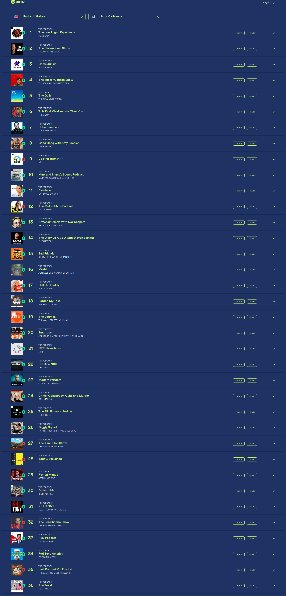

# 🎙️ Dwarkesh Podcast - Spotify Chart Rankings

## Latest Update
- **Date**: 2026-01-13
- **Ranking**: # 📊
- **Trend**: First recording
- **Status**: ❌ Not found on charts

## Recent History (Last 10 Days)

| Date | Ranking | Change | Notes |
|------|---------|--------|-------|
| 2026-01-13 | # | - | Dwarkesh Podcast does not appear in the top 36 pod |
| 2026-01-12 | # | - | Dwarkesh Podcast does not appear in the visible to |
| 2026-01-11 | # | - | Dwarkesh Podcast not found in the visible rankings |
| 2026-01-10 | # | - | Dwarkesh Podcast is not visible in positions 1-36  |
| 2026-01-09 | # | - | Dwarkesh Podcast does not appear in the top 36 vis |
| 2026-01-08 | # | - | Dwarkesh Podcast does not appear in the visible to |
| 2026-01-07 | # | - | Dwarkesh Podcast is not visible in the top 36 rank |
| 2026-01-06 | # | - | Dwarkesh Podcast is not visible in positions 1-36  |
| 2026-01-05 | # | - | Dwarkesh Podcast is not visible in positions 1-36  |
| 2026-01-04 | # | - | Searched through all 36 visible podcast entries. N |

## 📈 Statistics
- **Best Ranking**: #16
- **Current Ranking**: #
- **Average Ranking**: #50.7
- **Total Tracking Days**: 94
- **Days on Charts**: 15

## 📸 Latest Screenshot

---
*Last updated: 2026-01-13 10:07:10 UTC*
*Tracking powered by Claude Vision API & Playwright*
