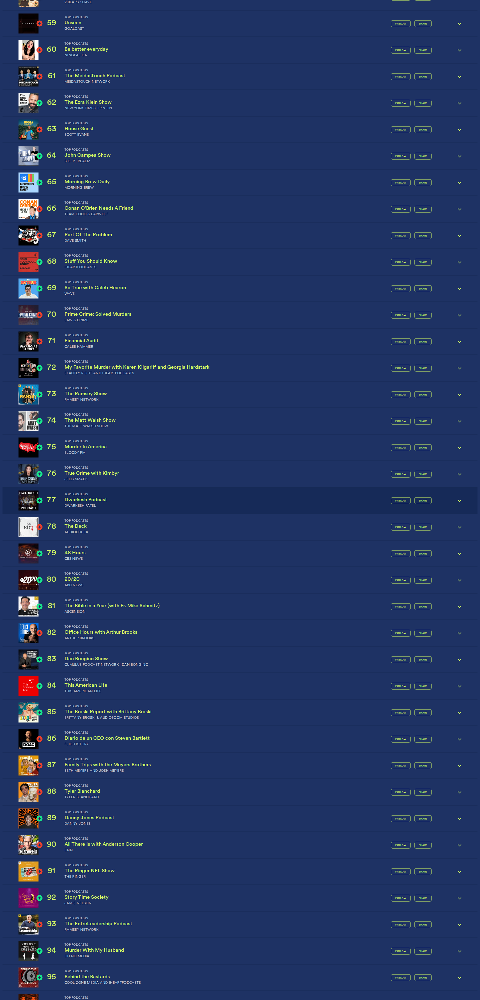

# 🎙️ Dwarkesh Podcast - Spotify Chart Rankings

## Latest Update
- **Date**: 2026-02-20
- **Ranking**: #77 🚀
- **Trend**: Up 15 positions
- **Status**: ✅ Found on charts

## Recent History (Last 10 Days)

| Date | Ranking | Change | Notes |
|------|---------|--------|-------|
| 2026-02-20 | #77 | 🚀 +15 | Found at rank 77, hosted by DWARKESH PATEL |
| 2026-02-19 | #92 | - | Found at rank 92, hosted by Dwarkesh Patel |
| 2026-02-18 | # | - | Dwarkesh Podcast is not visible in the top 36 podc |
| 2026-02-17 | # | - | Dwarkesh Podcast does not appear in the visible ra |
| 2026-02-16 | # | - | Dwarkesh Podcast does not appear in the visible to |
| 2026-02-15 | # | - | Dwarkesh Podcast is not visible in the top 36 podc |
| 2026-02-14 | # | - | Dwarkesh Podcast not found in the visible top 36 p |
| 2026-02-13 | # | - | Dwarkesh Podcast does not appear in the visible to |
| 2026-02-12 | # | - | Dwarkesh Podcast does not appear in the visible ra |
| 2026-02-11 | # | - | Dwarkesh Podcast does not appear in the visible to |

## 📈 Statistics
- **Best Ranking**: #16
- **Current Ranking**: #77
- **Average Ranking**: #54.6
- **Total Tracking Days**: 132
- **Days on Charts**: 17

## 📸 Latest Screenshot

---
*Last updated: 2026-02-20 10:14:10 UTC*
*Tracking powered by Claude Vision API & Playwright*
