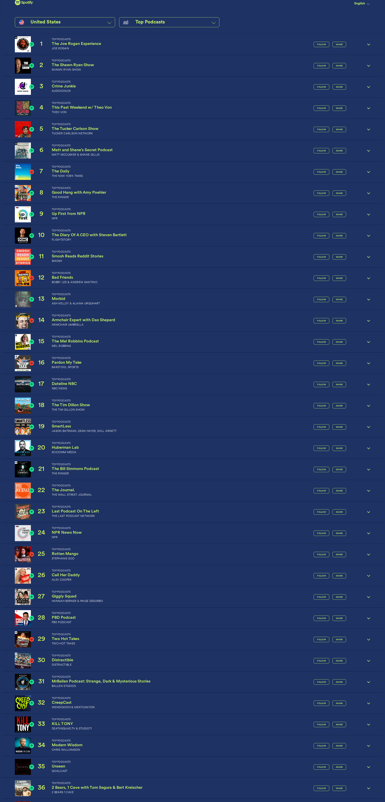

# 🎙️ Dwarkesh Podcast - Spotify Chart Rankings

## Latest Update
- **Date**: 2026-01-03
- **Ranking**: # 📊
- **Trend**: First recording
- **Status**: ❌ Not found on charts

## Recent History (Last 10 Days)

| Date | Ranking | Change | Notes |
|------|---------|--------|-------|
| 2026-01-03 | # | - | Searched through all 36 visible podcasts on the ch |
| 2026-01-02 | # | - | Dwarkesh Podcast does not appear in the visible to |
| 2026-01-01 | # | - | Dwarkesh Podcast is not visible in the top 36 podc |
| 2025-12-31 | # | - | Dwarkesh Podcast is not visible in rankings 1-36 s |
| 2025-12-30 | # | - | Dwarkesh Podcast or any variation was not found in |
| 2025-12-29 | # | - | Dwarkesh Podcast or any variation was not found in |
| 2025-12-28 | # | - | Searched through all 36 visible podcasts in the ch |
| 2025-12-27 | # | - | Dwarkesh Podcast does not appear in the visible To |
| 2025-12-26 | # | - | Dwarkesh Podcast is not visible in the top 36 rank |
| 2025-12-25 | # | - | Dwarkesh Podcast does not appear in the top 36 pod |

## 📈 Statistics
- **Best Ranking**: #16
- **Current Ranking**: #
- **Average Ranking**: #50.7
- **Total Tracking Days**: 84
- **Days on Charts**: 15

## 📸 Latest Screenshot

---
*Last updated: 2026-01-03 10:05:49 UTC*
*Tracking powered by Claude Vision API & Playwright*
