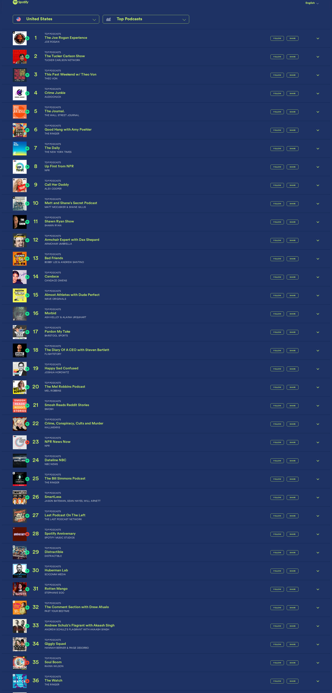

# 🎙️ Dwarkesh Podcast - Spotify Chart Rankings

## Latest Update
- **Date**: 2025-11-03
- **Ranking**: # 📊
- **Trend**: First recording
- **Status**: ❌ Not found on charts

## Recent History (Last 10 Days)

| Date | Ranking | Change | Notes |
|------|---------|--------|-------|
| 2025-11-03 | # | - | Dwarkesh Podcast does not appear in the visible ra |
| 2025-11-02 | # | - | Dwarkesh Podcast does not appear in the top 36 pod |
| 2025-11-01 | # | - | Searched through all 36 visible podcasts in the ch |
| 2025-10-31 | # | - | Dwarkesh Podcast does not appear in the visible to |
| 2025-10-30 | # | - | Searched through all 36 visible podcasts in the ch |
| 2025-10-29 | #84 | 📉 -4 | Found at rank 84, hosted by Dwarkesh Patel |
| 2025-10-28 | #80 | 🚀 +7 | Found at rank 80, hosted by DWARKESH PATEL |
| 2025-10-27 | #87 | 🚀 +5 | Found at rank 87, hosted by DWARKESH PATEL |
| 2025-10-26 | #92 | - | Found at rank 92, hosted by DWARKESH PATEL |
| 2025-10-25 | # | - | Dwarkesh Podcast does not appear in the visible to |

## 📈 Statistics
- **Best Ranking**: #16
- **Current Ranking**: #
- **Average Ranking**: #47.2
- **Total Tracking Days**: 23
- **Days on Charts**: 14

## 📸 Latest Screenshot

---
*Last updated: 2025-11-03 10:08:16 UTC*
*Tracking powered by Claude Vision API & Playwright*
