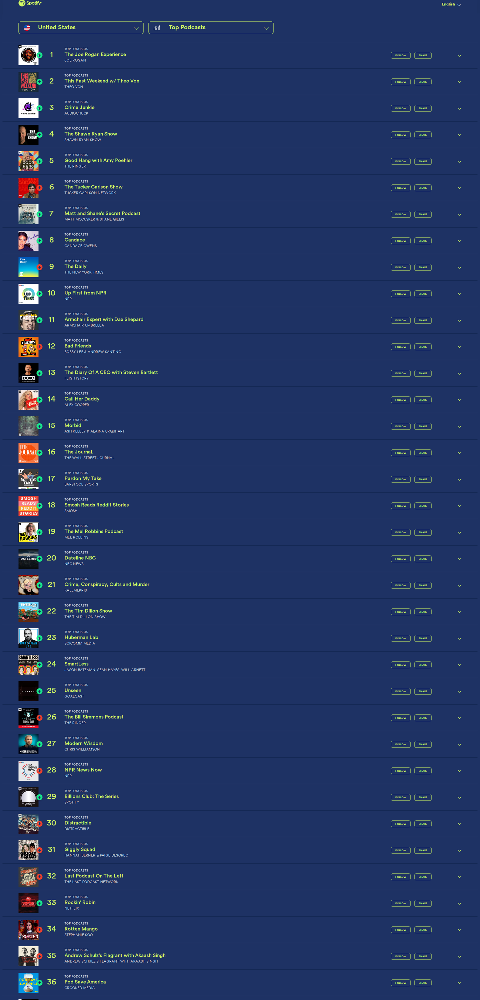

# 🎙️ Dwarkesh Podcast - Spotify Chart Rankings

## Latest Update
- **Date**: 2025-12-24
- **Ranking**: # 📊
- **Trend**: First recording
- **Status**: ❌ Not found on charts

## Recent History (Last 10 Days)

| Date | Ranking | Change | Notes |
|------|---------|--------|-------|
| 2025-12-24 | # | - | Searched through all 36 visible podcast rankings ( |
| 2025-12-23 | # | - | Dwarkesh Podcast does not appear in the visible ra |
| 2025-12-22 | # | - | Dwarkesh Podcast is not visible in rankings 1-36 s |
| 2025-12-21 | # | - | Carefully searched all 36 visible podcast entries  |
| 2025-12-20 | # | - | Dwarkesh Podcast is not visible in the top 36 rank |
| 2025-12-19 | # | - | Dwarkesh Podcast does not appear in the visible to |
| 2025-12-18 | # | - | Searched all 36 visible entries (ranks 1-36). No p |
| 2025-12-17 | # | - | Dwarkesh Podcast does not appear in the visible ra |
| 2025-12-16 | # | - | Dwarkesh Podcast does not appear in the visible to |
| 2025-12-15 | # | - | Dwarkesh Podcast is not visible in the top 36 podc |

## 📈 Statistics
- **Best Ranking**: #16
- **Current Ranking**: #
- **Average Ranking**: #50.7
- **Total Tracking Days**: 74
- **Days on Charts**: 15

## 📸 Latest Screenshot

---
*Last updated: 2025-12-24 10:05:57 UTC*
*Tracking powered by Claude Vision API & Playwright*
