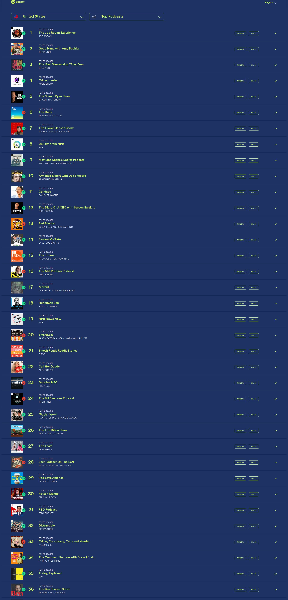

# 🎙️ Dwarkesh Podcast - Spotify Chart Rankings

## Latest Update
- **Date**: 2026-01-23
- **Ranking**: # 📊
- **Trend**: First recording
- **Status**: ❌ Not found on charts

## Recent History (Last 10 Days)

| Date | Ranking | Change | Notes |
|------|---------|--------|-------|
| 2026-01-23 | # | - | Dwarkesh Podcast not found in positions 1-36 of th |
| 2026-01-22 | # | - | Dwarkesh Podcast is not visible in ranks 1-36 of t |
| 2026-01-21 | # | - | Dwarkesh Podcast does not appear in the top 36 vis |
| 2026-01-20 | # | - | Dwarkesh Podcast is not visible in the top 36 podc |
| 2026-01-19 | # | - | Searched through all 36 visible podcasts in the ch |
| 2026-01-18 | # | - | Dwarkesh Podcast is not visible in this screenshot |
| 2026-01-17 | # | - | Dwarkesh Podcast does not appear in the visible ra |
| 2026-01-16 | # | - | Searched through all 36 visible podcasts in the ch |
| 2026-01-15 | # | - | Dwarkesh Podcast does not appear in the visible ra |
| 2026-01-14 | # | - | Dwarkesh Podcast does not appear in the visible To |

## 📈 Statistics
- **Best Ranking**: #16
- **Current Ranking**: #
- **Average Ranking**: #50.7
- **Total Tracking Days**: 104
- **Days on Charts**: 15

## 📸 Latest Screenshot

---
*Last updated: 2026-01-23 10:06:59 UTC*
*Tracking powered by Claude Vision API & Playwright*
