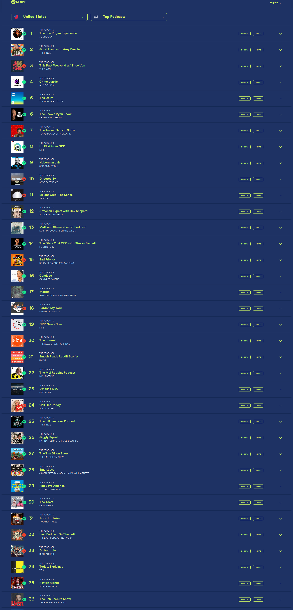

# 🎙️ Dwarkesh Podcast - Spotify Chart Rankings

## Latest Update
- **Date**: 2026-02-05
- **Ranking**: # 📊
- **Trend**: First recording
- **Status**: ❌ Not found on charts

## Recent History (Last 10 Days)

| Date | Ranking | Change | Notes |
|------|---------|--------|-------|
| 2026-02-05 | # | - | Searched through all 36 visible podcasts in the ch |
| 2026-02-04 | # | - | Searched through all 36 visible podcast rankings ( |
| 2026-02-03 | # | - | Dwarkesh Podcast does not appear in the visible to |
| 2026-02-02 | # | - | Dwarkesh Podcast is not visible in the top 36 rank |
| 2026-02-01 | # | - | Searched through all 36 visible podcasts in the ch |
| 2026-01-31 | # | - | Dwarkesh Podcast is not visible in the top 36 rank |
| 2026-01-30 | # | - | Dwarkesh Podcast does not appear in the visible ra |
| 2026-01-29 | # | - | Dwarkesh Podcast does not appear in the visible ra |
| 2026-01-28 | # | - | Dwarkesh Podcast does not appear in the visible ra |
| 2026-01-27 | # | - | Dwarkesh Podcast does not appear in the visible ra |

## 📈 Statistics
- **Best Ranking**: #16
- **Current Ranking**: #
- **Average Ranking**: #50.7
- **Total Tracking Days**: 117
- **Days on Charts**: 15

## 📸 Latest Screenshot

---
*Last updated: 2026-02-05 10:17:24 UTC*
*Tracking powered by Claude Vision API & Playwright*
