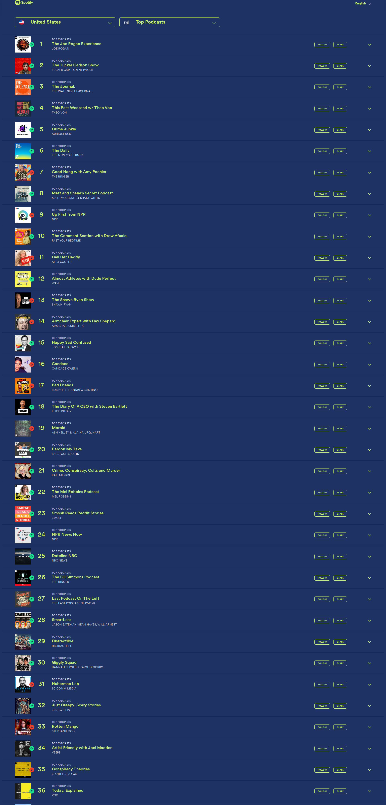

# 🎙️ Dwarkesh Podcast - Spotify Chart Rankings

## Latest Update
- **Date**: 2025-11-06
- **Ranking**: # 📊
- **Trend**: First recording
- **Status**: ❌ Not found on charts

## Recent History (Last 10 Days)

| Date | Ranking | Change | Notes |
|------|---------|--------|-------|
| 2025-11-06 | # | - | Searched through all 36 visible podcasts on this c |
| 2025-11-05 | # | - | Dwarkesh Podcast is not visible in the top 36 rank |
| 2025-11-04 | # | - | Dwarkesh Podcast does not appear in the top 36 pod |
| 2025-11-03 | # | - | Dwarkesh Podcast does not appear in the visible ra |
| 2025-11-02 | # | - | Dwarkesh Podcast does not appear in the top 36 pod |
| 2025-11-01 | # | - | Searched through all 36 visible podcasts in the ch |
| 2025-10-31 | # | - | Dwarkesh Podcast does not appear in the visible to |
| 2025-10-30 | # | - | Searched through all 36 visible podcasts in the ch |
| 2025-10-29 | #84 | 📉 -4 | Found at rank 84, hosted by Dwarkesh Patel |
| 2025-10-28 | #80 | - | Found at rank 80, hosted by DWARKESH PATEL |

## 📈 Statistics
- **Best Ranking**: #16
- **Current Ranking**: #
- **Average Ranking**: #47.2
- **Total Tracking Days**: 26
- **Days on Charts**: 14

## 📸 Latest Screenshot

---
*Last updated: 2025-11-06 10:07:06 UTC*
*Tracking powered by Claude Vision API & Playwright*
