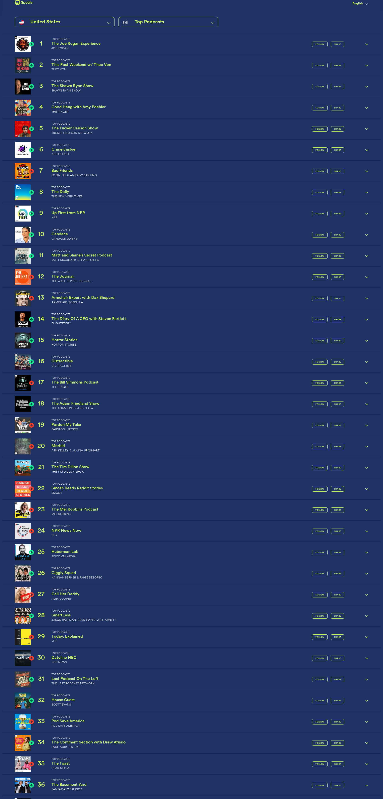

# 🎙️ Dwarkesh Podcast - Spotify Chart Rankings

## Latest Update
- **Date**: 2026-02-15
- **Ranking**: # 📊
- **Trend**: First recording
- **Status**: ❌ Not found on charts

## Recent History (Last 10 Days)

| Date | Ranking | Change | Notes |
|------|---------|--------|-------|
| 2026-02-15 | # | - | Dwarkesh Podcast is not visible in the top 36 podc |
| 2026-02-14 | # | - | Dwarkesh Podcast not found in the visible top 36 p |
| 2026-02-13 | # | - | Dwarkesh Podcast does not appear in the visible to |
| 2026-02-12 | # | - | Dwarkesh Podcast does not appear in the visible ra |
| 2026-02-11 | # | - | Dwarkesh Podcast does not appear in the visible to |
| 2026-02-10 | # | - | Dwarkesh Podcast does not appear in the visible to |
| 2026-02-09 | # | - | Dwarkesh Podcast not found in visible rankings 1-3 |
| 2026-02-08 | # | - | Dwarkesh Podcast and its variations are not visibl |
| 2026-02-07 | # | - | Dwarkesh Podcast does not appear in the visible to |
| 2026-02-06 | # | - | Dwarkesh Podcast or any variation with 'Dwarkesh'  |

## 📈 Statistics
- **Best Ranking**: #16
- **Current Ranking**: #
- **Average Ranking**: #50.7
- **Total Tracking Days**: 127
- **Days on Charts**: 15

## 📸 Latest Screenshot

---
*Last updated: 2026-02-15 10:07:25 UTC*
*Tracking powered by Claude Vision API & Playwright*
