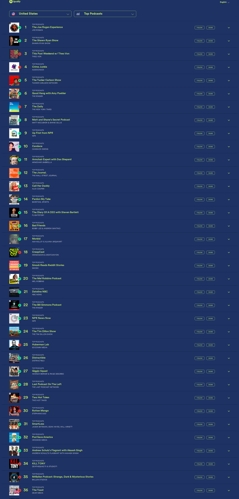

# 🎙️ Dwarkesh Podcast - Spotify Chart Rankings

## Latest Update
- **Date**: 2025-12-10
- **Ranking**: # 📊
- **Trend**: First recording
- **Status**: ❌ Not found on charts

## Recent History (Last 10 Days)

| Date | Ranking | Change | Notes |
|------|---------|--------|-------|
| 2025-12-10 | # | - | Dwarkesh Podcast does not appear in ranks 1-36 of  |
| 2025-12-09 | # | - | Dwarkesh Podcast does not appear in the visible to |
| 2025-12-08 | # | - | Searched through all 36 visible podcasts in the ch |
| 2025-12-07 | # | - | Dwarkesh Podcast is not visible in ranks 1-36 of t |
| 2025-12-06 | # | - | Searched through all 36 visible podcasts in the ch |
| 2025-12-05 | # | - | Dwarkesh Podcast does not appear in the top 36 pod |
| 2025-12-04 | # | - | Dwarkesh Podcast is not visible in the top 36 podc |
| 2025-12-03 | # | - | Searched through all 36 visible podcasts in the ch |
| 2025-12-02 | # | - | Dwarkesh Podcast does not appear in the visible ra |
| 2025-12-01 | # | - | Dwarkesh Podcast not found in positions 1-36 of th |

## 📈 Statistics
- **Best Ranking**: #16
- **Current Ranking**: #
- **Average Ranking**: #50.7
- **Total Tracking Days**: 60
- **Days on Charts**: 15

## 📸 Latest Screenshot

---
*Last updated: 2025-12-10 10:06:52 UTC*
*Tracking powered by Claude Vision API & Playwright*
