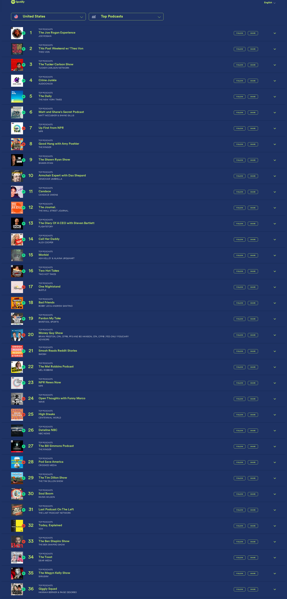

# 🎙️ Dwarkesh Podcast - Spotify Chart Rankings

## Latest Update
- **Date**: 2025-11-15
- **Ranking**: # 📊
- **Trend**: First recording
- **Status**: ❌ Not found on charts

## Recent History (Last 10 Days)

| Date | Ranking | Change | Notes |
|------|---------|--------|-------|
| 2025-11-15 | # | - | Dwarkesh Podcast does not appear in the visible to |
| 2025-11-14 | # | - | Dwarkesh Podcast does not appear in the visible to |
| 2025-11-13 | # | - | Dwarkesh Podcast is not visible in positions 1-36  |
| 2025-11-12 | # | - | Searched through all 36 visible podcasts on the ch |
| 2025-11-11 | # | - | Dwarkesh Podcast does not appear in the visible to |
| 2025-11-10 | # | - | Dwarkesh Podcast does not appear in the top 36 vis |
| 2025-11-09 | # | - | Dwarkesh Podcast does not appear in the visible to |
| 2025-11-08 | # | - | Searched through all 36 visible podcasts in the ch |
| 2025-11-07 | # | - | Dwarkesh Podcast is not visible in the top 36 podc |
| 2025-11-06 | # | - | Searched through all 36 visible podcasts on this c |

## 📈 Statistics
- **Best Ranking**: #16
- **Current Ranking**: #
- **Average Ranking**: #47.2
- **Total Tracking Days**: 35
- **Days on Charts**: 14

## 📸 Latest Screenshot

---
*Last updated: 2025-11-15 10:17:56 UTC*
*Tracking powered by Claude Vision API & Playwright*
