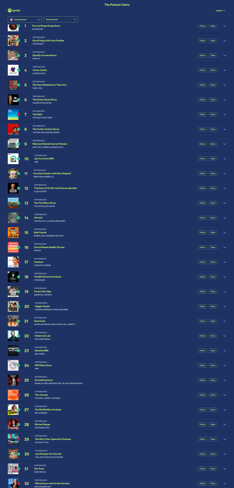

# 🎙️ Dwarkesh Podcast - Spotify Chart Rankings

## Latest Update
- **Date**: 2026-05-14
- **Ranking**: # 📊
- **Trend**: First recording
- **Status**: ❌ Not found on charts

## Recent History (Last 10 Days)

| Date | Ranking | Change | Notes |
|------|---------|--------|-------|
| 2026-05-14 | # | - | Dwarkesh Podcast and its variations are not visibl |
| 2026-05-13 | # | - | Dwarkesh Podcast is not visible in rankings 1-32 s |
| 2026-05-12 | # | - | Dwarkesh Podcast is not visible in the shown ranki |
| 2026-05-10 | # | - | Searched through all 32 visible rankings on the Sp |
| 2026-05-09 | # | - | Dwarkesh Podcast not found in the visible rankings |
| 2026-05-08 | # | - | Dwarkesh Podcast or any variation was not found in |
| 2026-05-07 | # | - | Dwarkesh Podcast does not appear in the visible ra |
| 2026-05-06 | # | - | Searched through all 32 visible podcasts on this c |
| 2026-05-05 | # | - | Dwarkesh Podcast does not appear in the visible ra |
| 2026-05-04 | # | - | Searched through all 32 visible rankings on the ch |

## 📈 Statistics
- **Best Ranking**: #16
- **Current Ranking**: #
- **Average Ranking**: #59.2
- **Total Tracking Days**: 174
- **Days on Charts**: 22

## 📸 Latest Screenshot

---
*Last updated: 2026-05-14 10:50:04 UTC*
*Tracking powered by Claude Vision API & Playwright*
