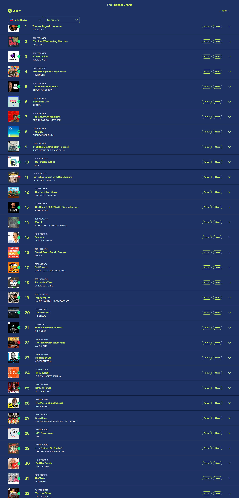

# 🎙️ Dwarkesh Podcast - Spotify Chart Rankings

## Latest Update
- **Date**: 2026-05-24
- **Ranking**: # 📊
- **Trend**: First recording
- **Status**: ❌ Not found on charts

## Recent History (Last 10 Days)

| Date | Ranking | Change | Notes |
|------|---------|--------|-------|
| 2026-05-24 | # | - | Dwarkesh Podcast does not appear in the visible ra |
| 2026-05-23 | # | - | Dwarkesh Podcast is not visible in the top 32 rank |
| 2026-05-22 | # | - | Dwarkesh Podcast (or any variation) is not visible |
| 2026-05-21 | # | - | Dwarkesh Podcast or any variations were not found  |
| 2026-05-20 | # | - | Dwarkesh Podcast does not appear in the visible ra |
| 2026-05-19 | # | - | Searched through all 32 visible podcasts on the ch |
| 2026-05-18 | # | - | Searched through all 32 visible podcasts on the ch |
| 2026-05-17 | # | - | Dwarkesh Podcast is not visible in positions 1-32  |
| 2026-05-16 | # | - | Searched through all 32 visible podcast entries. N |
| 2026-05-15 | # | - | Dwarkesh Podcast is not visible in the rankings 1- |

## 📈 Statistics
- **Best Ranking**: #16
- **Current Ranking**: #
- **Average Ranking**: #59.2
- **Total Tracking Days**: 184
- **Days on Charts**: 22

## 📸 Latest Screenshot

---
*Last updated: 2026-05-24 10:35:33 UTC*
*Tracking powered by Claude Vision API & Playwright*
