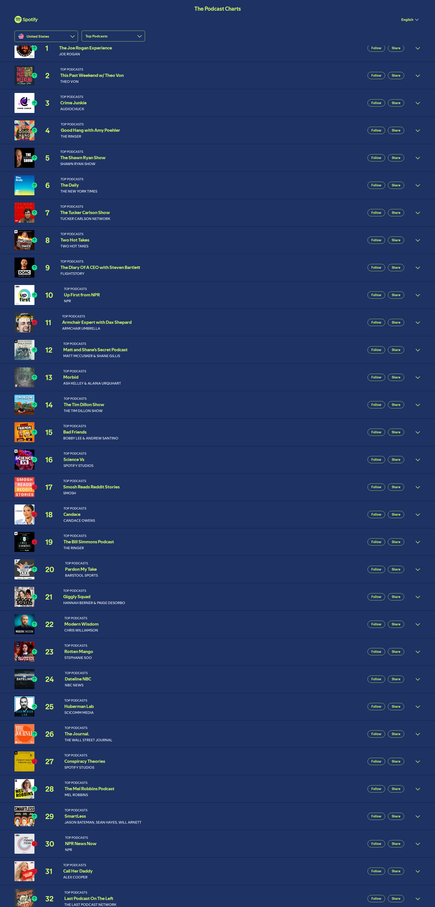

# 🎙️ Dwarkesh Podcast - Spotify Chart Rankings

## Latest Update
- **Date**: 2026-06-28
- **Ranking**: # 📊
- **Trend**: First recording
- **Status**: ❌ Not found on charts

## Recent History (Last 10 Days)

| Date | Ranking | Change | Notes |
|------|---------|--------|-------|
| 2026-06-28 | # | - | Dwarkesh Podcast is not visible in the top 32 rank |
| 2026-06-27 | # | - | Dwarkesh Podcast is not visible in the top 32 rank |
| 2026-06-26 | # | - | Dwarkesh Podcast does not appear in the visible to |
| 2026-06-25 | # | - | Dwarkesh Podcast is not visible in the top 32 rank |
| 2026-06-24 | # | - | Dwarkesh Podcast is not visible in the displayed r |
| 2026-06-23 | # | - | Dwarkesh Podcast is not visible in rankings 1-32 o |
| 2026-06-22 | # | - | Dwarkesh Podcast is not visible in the top 32 rank |
| 2026-06-21 | # | - | Dwarkesh Podcast and its variations are not visibl |
| 2026-06-20 | # | - | Dwarkesh Podcast does not appear in the visible ra |
| 2026-06-19 | # | - | Searched through all 32 visible podcast rankings ( |

## 📈 Statistics
- **Best Ranking**: #16
- **Current Ranking**: #
- **Average Ranking**: #59.2
- **Total Tracking Days**: 218
- **Days on Charts**: 22

## 📸 Latest Screenshot

---
*Last updated: 2026-06-28 10:47:23 UTC*
*Tracking powered by Claude Vision API & Playwright*
