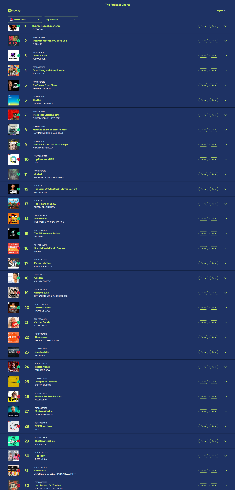

# 🎙️ Dwarkesh Podcast - Spotify Chart Rankings

## Latest Update
- **Date**: 2026-06-15
- **Ranking**: # 📊
- **Trend**: First recording
- **Status**: ❌ Not found on charts

## Recent History (Last 10 Days)

| Date | Ranking | Change | Notes |
|------|---------|--------|-------|
| 2026-06-15 | # | - | Dwarkesh Podcast does not appear in the visible to |
| 2026-06-14 | # | - | Searched through all 32 visible podcast rankings ( |
| 2026-06-13 | # | - | Dwarkesh Podcast does not appear in the visible to |
| 2026-06-12 | # | - | Dwarkesh Podcast does not appear in the visible ra |
| 2026-06-11 | # | - | Dwarkesh Podcast is not found in the visible ranki |
| 2026-06-10 | # | - | Dwarkesh Podcast does not appear in the visible ra |
| 2026-06-09 | # | - | Dwarkesh Podcast does not appear in the visible to |
| 2026-06-08 | # | - | Dwarkesh Podcast does not appear in the visible to |
| 2026-06-07 | # | - | Searched through all 32 visible podcasts on the ch |
| 2026-06-06 | # | - | Searched through all 32 visible rankings on this S |

## 📈 Statistics
- **Best Ranking**: #16
- **Current Ranking**: #
- **Average Ranking**: #59.2
- **Total Tracking Days**: 205
- **Days on Charts**: 22

## 📸 Latest Screenshot

---
*Last updated: 2026-06-15 12:04:19 UTC*
*Tracking powered by Claude Vision API & Playwright*
