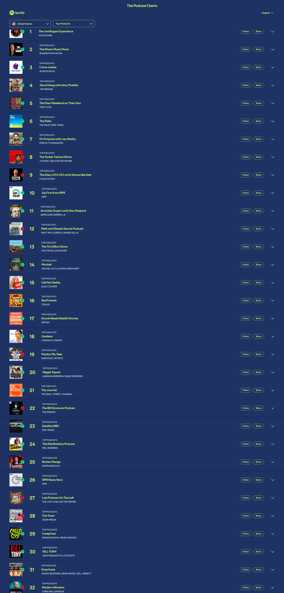

# 🎙️ Dwarkesh Podcast - Spotify Chart Rankings

## Latest Update
- **Date**: 2026-07-19
- **Ranking**: # 📊
- **Trend**: First recording
- **Status**: ❌ Not found on charts

## Recent History (Last 10 Days)

| Date | Ranking | Change | Notes |
|------|---------|--------|-------|
| 2026-07-19 | # | - | Searched through all visible rankings 1-32 on the  |
| 2026-07-18 | # | - | Dwarkesh Podcast is not visible in the top 32 rank |
| 2026-07-17 | # | - | Dwarkesh Podcast is not visible in the top 32 rank |
| 2026-07-16 | # | - | Searched through all 32 visible podcast entries on |
| 2026-07-15 | # | - | Dwarkesh Podcast does not appear in the visible ra |
| 2026-07-14 | # | - | Dwarkesh Podcast does not appear in the visible ra |
| 2026-07-13 | # | - | Dwarkesh Podcast does not appear in the visible ra |
| 2026-07-12 | # | - | Dwarkesh Podcast does not appear in the visible ra |
| 2026-07-11 | # | - | Dwarkesh Podcast is not visible in the displayed r |
| 2026-07-10 | # | - | Dwarkesh Podcast does not appear in positions 1-32 |

## 📈 Statistics
- **Best Ranking**: #16
- **Current Ranking**: #
- **Average Ranking**: #59.2
- **Total Tracking Days**: 238
- **Days on Charts**: 22

## 📸 Latest Screenshot

---
*Last updated: 2026-07-19 11:08:16 UTC*
*Tracking powered by Claude Vision API & Playwright*
