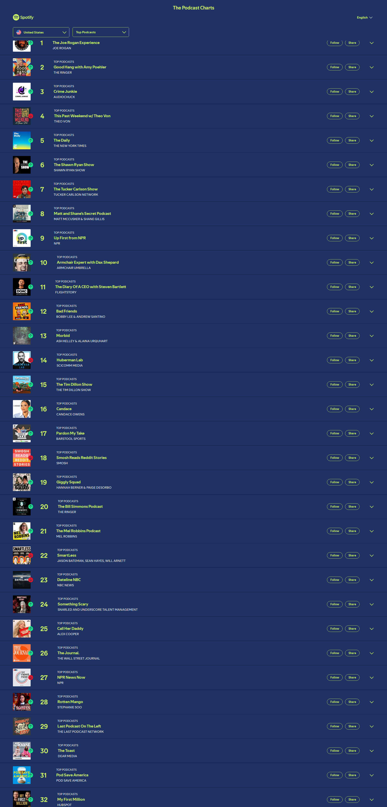

# 🎙️ Dwarkesh Podcast - Spotify Chart Rankings

## Latest Update
- **Date**: 2026-05-06
- **Ranking**: # 📊
- **Trend**: First recording
- **Status**: ❌ Not found on charts

## Recent History (Last 10 Days)

| Date | Ranking | Change | Notes |
|------|---------|--------|-------|
| 2026-05-06 | # | - | Searched through all 32 visible podcasts on this c |
| 2026-05-05 | # | - | Dwarkesh Podcast does not appear in the visible ra |
| 2026-05-04 | # | - | Searched through all 32 visible rankings on the ch |
| 2026-05-03 | # | - | Searched through all 32 visible rankings on the ch |
| 2026-05-02 | # | - | Dwarkesh Podcast is not visible in rankings 1-32 s |
| 2026-05-01 | # | - | Dwarkesh Podcast not found in the visible top 32 r |
| 2026-04-30 | # | - | Searched through all 32 visible podcast rankings a |
| 2026-04-29 | # | - | Searched through all 32 visible podcast entries on |
| 2026-04-28 | # | - | Dwarkesh Podcast does not appear in the visible ra |
| 2026-04-27 | # | - | Dwarkesh Podcast is not visible in the top 32 rank |

## 📈 Statistics
- **Best Ranking**: #16
- **Current Ranking**: #
- **Average Ranking**: #59.2
- **Total Tracking Days**: 167
- **Days on Charts**: 22

## 📸 Latest Screenshot

---
*Last updated: 2026-05-06 10:43:30 UTC*
*Tracking powered by Claude Vision API & Playwright*
