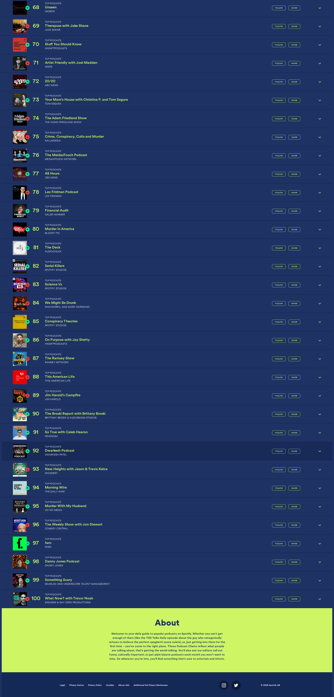

# 🎙️ Dwarkesh Podcast - Spotify Chart Rankings

## Latest Update
- **Date**: 2025-10-26
- **Ranking**: #92 📊
- **Trend**: First recording
- **Status**: ✅ Found on charts

## Recent History (Last 10 Days)

| Date | Ranking | Change | Notes |
|------|---------|--------|-------|
| 2025-10-26 | #92 | - | Found at rank 92, hosted by DWARKESH PATEL |
| 2025-10-25 | # | - | Dwarkesh Podcast does not appear in the visible to |
| 2025-10-24 | # | - | Searched through all 36 visible podcasts (ranks 1- |
| 2025-10-23 | # | - | Searched through all 36 visible podcasts in the ch |
| 2025-10-22 | # | - | Dwarkesh Podcast is not visible in ranks 1-36 of t |
| 2025-10-21 | #90 | 📉 -30 | Found at rank 90, hosted by DWARKESH PATEL |
| 2025-10-20 | #60 | 📉 -19 | Found at rank 60, listed under 'DWARKESH PATEL' as |
| 2025-10-19 | #41 | 📉 -15 | Found at rank 41, hosted by DWARKESH PATEL |
| 2025-10-18 | #26 | 📉 -7 | Found at rank 26, hosted by DWARKESH PATEL |
| 2025-10-17 | #19 | - | Found at rank 19, hosted by DWARKESH PATEL |

## 📈 Statistics
- **Best Ranking**: #16
- **Current Ranking**: #92
- **Average Ranking**: #37.3
- **Total Tracking Days**: 15
- **Days on Charts**: 11

## 📸 Latest Screenshot

---
*Last updated: 2025-10-26 10:07:50 UTC*
*Tracking powered by Claude Vision API & Playwright*
